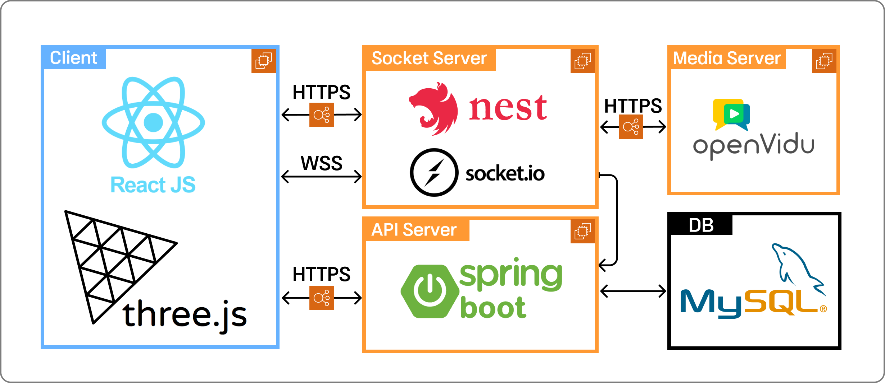

# Quizly: 3D 상호작용 기반의 몰입형 퀴즈 풀이 서비스

<!--  -->

## 프로젝트 개요

Quizly는 3D 환경에서 실시간 상호작용을 통해 즐겁고 효과적인 학습 경험을 제공하는 퀴즈 플랫폼입니다.

### 주요 기능

- 🌟 3D 가상 환경에서의 몰입형 퀴즈 경험
- 🎮 실시간 멀티플레이어 퀴즈
- 📊 다양한 퀴즈 모드 (객관식, 주관식)
- 👨‍🏫 교사를 위한 퀴즈 제작 및 관리 도구
- 📈 퀴즈 결과 분석 및 리포트

## 프로젝트 관련링크

- [프로젝트 포스터](https://github.com/user-attachments/assets/9bbd55f1-7050-46e6-9888-81714e33975f)
- [소개 영상](https://youtu.be/sUz-6YQ4_yQ)
- [발표 영상](https://youtu.be/vFkri4LvJX4)

## 기술 스택

- Frontend: React, Three.js, React Three Fiber
- Backend: Spring Boot, Nest.js
- Database: MySQL
- 실시간 통신: Socket.io
- 화상 통화: OpenVidu, LiveKit

## 시스템 아키텍처

Quizly는 다음 네 개의 주요 컴포넌트로 구성되어 있습니다:

1. **API 서버** (Spring Boot)
2. **프론트엔드** (React, Three.js)
3. **실시간 통신 서버** (Nest.js)
4. **화상 통화 서버** (OpenVidu)

### 시스템 아키텍쳐 다이어그램

## 레포지토리 구조

- [quizly-frontend](https://github.com/Quizly-Project/quizly-frontend) - React & Three.js 프론트엔드
- [quizly-spring](https://github.com/Quizly-Project/quizly-Spring) - Spring Boot API 서버
- [quizly-nest](https://github.com/Quizly-Project/quizly-Nest) - Nest.js 실시간 통신 서버
<!-- - [quizly-openvidu](https://github.com/Quizly-Project/quizly-multiCam) - OpenVidu 기반 화상 통화 서버 -->

## 설치 및 실행 방법

각 레포지토리에는 상세한 설치 및 실행 가이드가 포함되어 있습니다. 기본적인 단계는 다음과 같습니다:

1. 각 레포지토리를 클론합니다.
2. 필요한 의존성을 설치합니다.
3. 환경 변수를 설정합니다.
4. 각 서버를 실행합니다.

자세한 내용은 각 레포지토리의 README를 참조하세요.

## 크래프톤 정글

이 프로젝트는 크래프톤 정글 5기 '나만의 무기 만들기' 최종 팀 프로젝트로 개발되었습니다.

이 프로젝트는 크래프톤 정글 5기 교육 과정의 일환으로 개발되었습니다. 크래프톤 정글은 SW 개발자의 탄탄한 기본기를 기르는 데 중점을 둔 5개월 간의 고강도 교육 프로그램입니다.

[크래프톤 정글 더 알아보기](https://jungle.krafton.com)

## 팀 정보

- **프로젝트명**: Quizly - 3D 상호작용 기반의 몰입형 퀴즈 풀이 서비스
- **개발 기간**: 2024.06.21 - 2024.07.27 (5주)
- **팀명**: 크래프톤 정글 5기 1교육장 2팀

### 팀원 소개

| 이름   | 역할               | GitHub                                         |
| ------ | ------------------ | ---------------------------------------------- |
| 김현수 | Frontend Developer | [@hyunS00](https://github.com/hyunS00)         |
| 신동우 | Backend Developer  | [@NoNoise2022](https://github.com/NoNoise2022) |
| 유영우 | Backend Developer  | [@yoo20370](https://github.com/yoo20370)       |
| 조재룡 | Backend Developer  | [@jjr7181](https://github.com/jjr7181)         |
| 황연경 | Frontend Developer | [@yunnn426](https://github.com/yunnn426)       |
